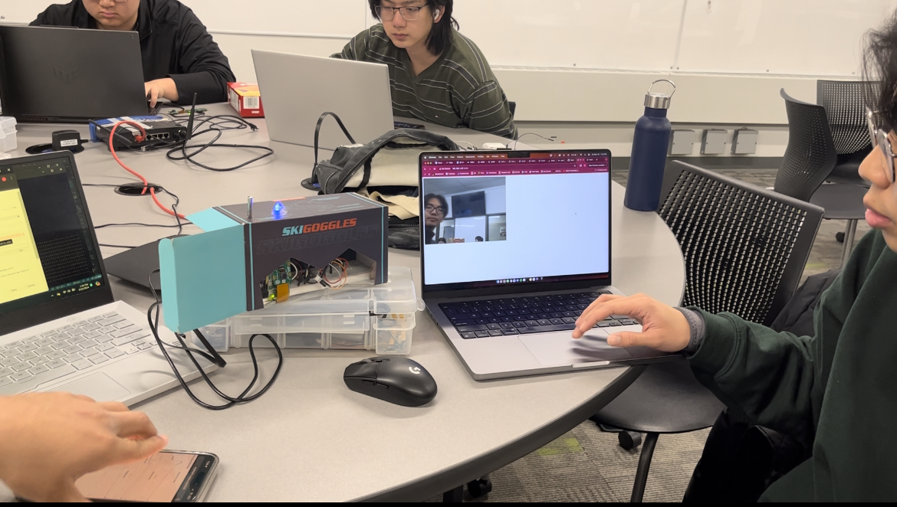
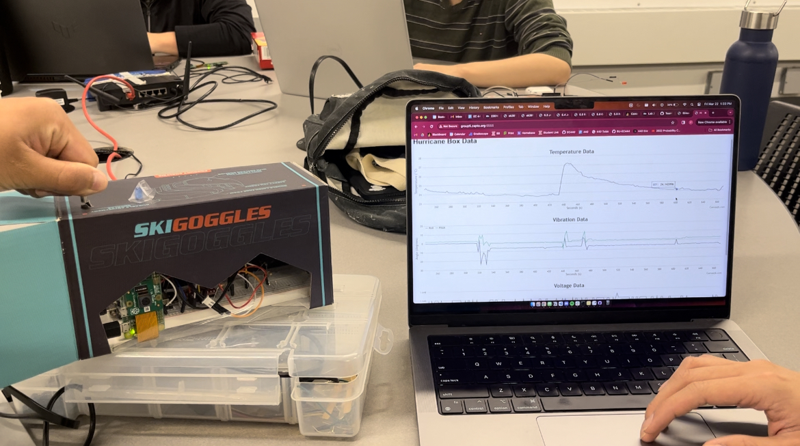

# Hurricane Box

Authors: Peter Zhao, Jared Solis, Sourav Shib

Date: 2024-03-22

### Summary
  This repository contains all the code and documentation for the group's hurricane box. The code folder contains the ESP32 code, node files, and html files. There is also a folder for the Rpi-Camera. 

### Self-Assessment 

| Objective Criterion | Rating | Max Value  | 
|---------------------------------------------|:-----------:|:---------:|
| Measures acceleration, temperature, and battery level | 1 |  1     | 
| Displays real-time data at remote client via portal using separate IP network | 1 |  1     | 
| Controls LED on box from remote client via portal | 1 |  1     | 
| Sources webcam video into remote client | 1 |  1     | 
| ESP32 and Rpi are connected wirelessly to router | 1 |  1     | 
| Demo delivered at scheduled time and report submitted in team folder | 1 |  1     | 
| Investigative question response | 1 |  1     | 

### Solution Design
  The physical design is a simple box with all of our components inside. We have the ESP32 connected to the ADXL343, battery monitor, thermistor, and LED wired onto a breadboard. We also taped down the Raspberry Pi connected to the camera which looks out the side of the box which is see-through. The thermistor and the led are poking out of the box on the top. The ESP32 is running three tasks which allow it to send over data for time, vibration, and voltage. We then use UDP to send this data over the local wifi to the web server hosted on a raspberrypi. Once we send the payload to the web server, the web server parses the data and outputs it on three different graphs to the client using socketIO and CanvasJS. We communicate back to the ESP to control the LED using UDP as well.

### Sketches/Diagrams

Hurricane Box

Pi Camera Streaming

Graphical Data on Remote Portal

### Supporting Artifacts
- [Quest 3 Video Presentation](https://drive.google.com/file/d/1ZvHeT1r76WSPQnQMnZrzi5lPBlVp1pd_/view?usp=sharing). Not to exceed 120s
- [Quest 3 Demo Video](https://drive.google.com/file/d/1vO5dnxnQLu6a2SlMsnY6bV_S39lWj-fO/view?usp=sharing). Not to exceed 120s

